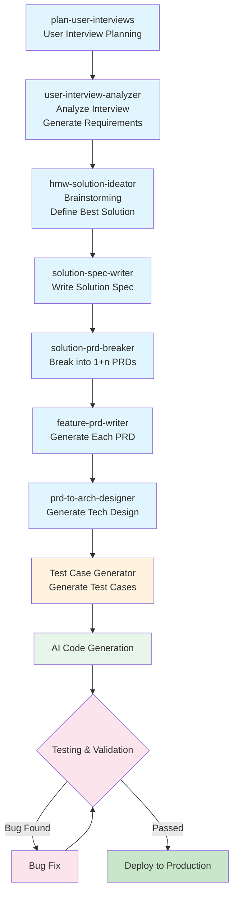

# PM-Skills

This repository is a container of several specialized skills designed to help Product Managers work with user needs, research, and documentation more efficiently using AI agents and tools that support skills.

## Skills Workflow

These skills form a complete product development workflow from user research to technical implementation:



### Workflow Steps

1. **[plan-user-interviews](./plan-user-interviews/)** - Plan user interviews and conduct user research
2. **[user-interview-analyzer](./user-interview-analyzer/)** - Analyze interview transcripts and generate requirements report
3. **[hmw-solution-ideator](./hmw-solution-ideator/)** - Brainstorm solutions based on requirements and define the best solution summary
4. **[solution-spec-writer](./solution-spec-writer/)** - Write the solution summary into a complete solution document
5. **[solution-prd-breaker](./solution-prd-breaker/)** - Break the solution document into "1 main + n dependent" PRDs
6. **[feature-prd-writer](./feature-prd-writer/)** - Generate detailed content for each PRD
7. **[prd-to-arch-designer](./prd-to-arch-designer/)** - Generate technical design documents based on PRDs
8. **Test Case Generator** *(Planned)* - Generate test cases
9. **AI Code Generation** - Generate code based on technical design documents
10. **Testing & Fix** - Test against test cases, fix bugs if found
11. **Deploy to Production**

## Available Skills

### `plan-user-interviews`
Assists Product Managers in planning effective user interviews. It ensures that research goals are clearly defined, target audiences are identified, and discussion guides are structured with unbiased, non-leading questions to extract genuine user insights.

- **Capabilities:**
  - Generate structured Interview Guides
  - Refine and formulate unbiased interview questions

## How to Use Skills

The skills in this repository are designed to be compatible with any AI agent or CLI tool that supports the `.skill` format or standard skill definitions. 

### General Usage

1. Provide the `SKILL.md` and any associated `references/` or `assets/` to your AI assistant.
2. Instruct the AI to adopt the skill, for example: "Please act according to the instructions in the `plan-user-interviews/SKILL.md` file."

### Tool-Specific Installation

For tools with native skill package management, you can install the pre-packaged `.skill` files directly:

1. **Download the skill:**
   Navigate to the [Releases page](../../releases) of this repository and download the latest `.skill` file for the skill you want to use.
   *(Note: The `.skill` files are automatically built and published via GitHub Actions on every release).*
   
2. **Install the skill:**
   Follow your specific tool's documentation for installing local skills. For example:
   ```bash
   # Example for compatible CLIs
   <cli-command> skills install ./<skill-name>.skill --scope workspace
   ```

3. **Reload your environment:**
   Ensure you reload your AI session or environment to activate the newly installed skill.

## Creating New Skills

To create a new skill in this repository:

1. Create a new directory for your skill.
2. Add a `SKILL.md` file with the required frontmatter (`name` and `description`) and detailed instructions.
3. Include any optional `scripts/`, `references/`, or `assets/` as needed by your workflows.
4. You can also ask your AI assistant to help you structure and write the skill based on standard skill templates.
